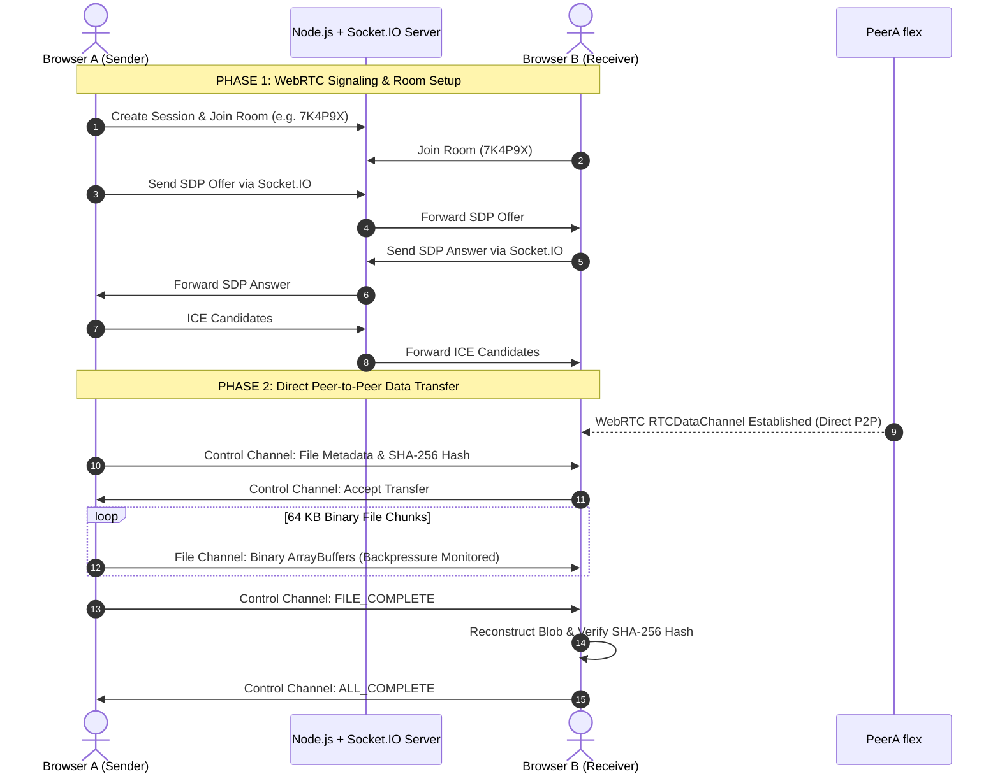

# PeerDrop — "Send files. Directly."


> **PeerDrop** is a production-quality, secure peer-to-peer file sharing application built with React, Vite, Node.js, Express, Socket.IO, WebRTC (`RTCDataChannel`), PostgreSQL, and Prisma.

---

## 🔒 Security & Data Architecture Guarantee

**The backend server NEVER receives, buffers, or stores actual file contents.**

- **Signaling**: The Node.js + Express + Socket.IO server exists exclusively to negotiate authentication, generate transfer room codes, coordinate peer sessions, and exchange WebRTC SDP Offers, SDP Answers, and ICE candidates.
- **File Data Transfer**: All binary file data flows **directly** between peer web browsers via encrypted WebRTC `RTCDataChannel`.



---

## ✨ Core Features

- **Direct WebRTC P2P Transfer**: File chunks stream directly browser-to-browser with 0 MB server storage overhead.
- **Apple Design Language**: Styled according to Apple's WWDC *Designing Fluid Interfaces* guidelines:
  - Instant touch-down press feedback (`scale(0.97)` active states).
  - Spring-based physical motion curves (`damping: 1.0`, velocity handoff).
  - Translucent glass materials (`backdrop-filter: blur(20px)`).
  - Typography optical sizing & size-specific tracking tables.
  - Dark mode with seamless theme toggle.
  - Accessibility first (`prefers-reduced-motion` cross-fades, `prefers-reduced-transparency` fallback).
- **Multi-Channel Architecture**:
  - `control`: Reliable JSON channel for transfer lifecycle (`METADATA_REQUEST`, `ACCEPT_TRANSFER`, `CANCEL_TRANSFER`, `FILE_COMPLETE`).
  - `file`: High-speed binary channel for 64 KB file chunks.
  - `chat`: Real-time P2P text messaging alongside transfers.
- **SHA-256 Integrity Verification**: Calculates cryptographic hash via Web Crypto API (`crypto.subtle`) pre/post transfer for 100% byte verification.
- **Backpressure & Flow Control**: Prevents browser memory bloat during multi-gigabyte file transfers using `RTCDataChannel.bufferedAmount` & `bufferedAmountLowThreshold`.
- **Instant QR Code & Room Sharing**: Generates high-density canvas QR codes and shareable links (`https://yourapp.com/receive/7K4P9X`).
- **User Authentication & Session Persistence**: JWT authentication with bcrypt password hashing and persistent Postgres transfer session logs.

---

## 🛠️ Tech Stack

### Frontend
- **Framework**: React 18 + TypeScript + Vite
- **Styling**: Tailwind CSS + Custom Apple Design Tokens
- **Icons**: Lucide React
- **Animation**: Motion / Framer Motion
- **QR Generator**: HTML5 Canvas QR Code (`qrcode`)

### Backend
- **Runtime**: Node.js + TypeScript
- **Web Framework**: Express.js
- **Signaling**: Socket.IO 4
- **Database**: PostgreSQL 16 + Prisma ORM 5
- **Security**: JWT, bcrypt, Helmet, CORS, Rate Limiting, Zod

### WebRTC Specification
- `RTCPeerConnection` with STUN server list (`stun.l.google.com:19302`).
- `RTCDataChannel` (`control`, `file`, `chat`).
- Web Crypto API (`crypto.subtle.digest('SHA-256')`).

---

## 📁 Repository Structure

```
peer-drop/
├── client/                     # React Frontend Application
│   ├── src/
│   │   ├── components/ui/      # Apple Design System UI (Button, GlassCard, ProgressBar, QRCodeModal)
│   │   ├── context/            # AuthContext & Theme state
│   │   ├── hooks/              # Custom hooks (useWebRTC, useFileTransfer, useChat, useAuth)
│   │   ├── pages/              # Landing, Login, Register, Dashboard, Send, Receive, ActiveTransfer, History, Profile
│   │   ├── services/           # WebRTCManager, Chunker (64KB + SHA-256), Receiver, API
│   │   ├── types/              # Shared TypeScript definitions
│   │   ├── App.tsx             # Routes & Protected Route wrapper
│   │   ├── index.css           # Apple design tokens, materials, reduced-motion
│   │   └── main.tsx
│   ├── vite.config.ts
│   └── package.json
│
├── server/                     # Express + Socket.IO Backend Application
│   ├── src/
│   │   ├── controllers/        # Auth & Session controllers
│   │   ├── middleware/         # JWT Auth, Rate Limiter, Error Handler
│   │   ├── routes/             # Auth & Session API endpoints
│   │   ├── sockets/            # WebRTC Socket.IO signaling handler
│   │   ├── utils/              # Prisma client & Room code generator
│   │   └── index.ts            # Server entry point
│   └── package.json
│
├── prisma/
│   └── schema.prisma           # Prisma PostgreSQL schema
│
├── docker-compose.yml          # Docker orchestration (PostgreSQL, Server, Client)
├── .env.example
└── README.md
```

---

## 🚦 Getting Started & Step-by-Step Terminal Commands

### Prerequisites
- **Node.js**: v20+ (`node -v`)
- **npm**: v10+ (`npm -v`)
- **Docker & Docker Compose**: (Optional, for database or full stack containerization)

---

### Option A: Local Development Setup (Step-by-Step Terminal Instructions)

Follow these exact commands sequentially in your terminal:

#### Step 1: Open Terminal & Navigate to Project Root
```bash
cd peerdrop
```

#### Step 2: Install All Dependencies (Root, Backend & Frontend)
```bash
npm run install:all
```

#### Step 3: Set Up Environment Configuration
```bash
# Windows PowerShell / CMD:
copy .env.example .env

# Bash / Linux / macOS:
cp .env.example .env
```

#### Step 4: Start PostgreSQL Database

**Option 4A — Using Docker (Recommended):**
```bash
docker compose up postgres -d
```

**Option 4B — Using Local PostgreSQL:**
Make sure PostgreSQL is running locally on port `5432` and matches your `DATABASE_URL` in `.env`.

#### Step 5: Push Database Schema & Generate Prisma Client
```bash
npm run db:push
```

#### Step 6: Start Full Application (Backend + Frontend Concurrently)
```bash
npm run dev
```

This concurrently starts:
- **Backend Express + Socket.IO Server**: `http://localhost:5000`
- **Frontend Vite React App**: `http://localhost:5173`

---

### Option B: Single Command Docker Setup (Production Mode)

To build and launch the complete stack (PostgreSQL + Express Server + Nginx Frontend) in Docker:

```bash
# Build and start all services in detached mode
docker compose up --build -d

# View status of running containers
docker compose ps

# View live application logs
docker compose logs -f
```

Access PeerDrop at **http://localhost:5173**.

---

### Step-by-Step WebRTC P2P Transfer Testing Procedure

To test actual peer-to-peer file sharing between two peers:

1. **Step 1: Open Sender Browser Window**
   - Open Chrome or Firefox to `http://localhost:5173`.
   - Register a new user account (e.g. `sender@example.com`) or click **"Send a file"**.
   - Drag & drop one or multiple files into the uploader card.
   - Click **"Create Secure Transfer"**.
   - Note the **6-character Room Code** (e.g., `7K4P9X`) or copy the share URL.

2. **Step 2: Open Receiver Browser Window**
   - Open an **Incognito / Private Window** or second browser (e.g. Edge/Firefox) to `http://localhost:5173`.
   - Log in or register as a second user (e.g. `receiver@example.com`).
   - Navigate to `/receive/7K4P9X` or enter `7K4P9X` in the Receive form.
   - Click **"Accept & Connect"**.

3. **Step 3: Direct Transfer & P2P Chat**
   - WebRTC `RTCDataChannel` will connect directly between the two windows.
   - Files will stream chunk-by-chunk with continuous progress, speed (MB/s), and ETA telemetry.
   - SHA-256 hash checks run automatically upon completion with a green **"SHA-256 Integrity Verified"** badge.
   - Test sending text messages over the RTCDataChannel chat panel.

---

### Build & Verification Commands

```bash
# Verify backend TypeScript compilation:
cd server && npm run build

# Verify frontend Vite production build:
cd client && npm run build
```

## 🗄️ Database Schema

```prisma
model User {
  id               String            @id @default(uuid())
  email            String            @unique
  name             String
  passwordHash     String
  createdAt        DateTime          @default(now())
  updatedAt        DateTime          @updatedAt
  sentSessions     TransferSession[] @relation("SenderSessions")
  receivedSessions TransferSession[] @relation("ReceiverSessions")
}

model TransferSession {
  id          String        @id @default(uuid())
  roomCode    String        @unique
  senderId    String
  receiverId  String?
  status      SessionStatus @default(WAITING)
  totalSize   BigInt        @default(0)
  fileCount   Int           @default(0)
  createdAt   DateTime      @default(now())
  expiresAt   DateTime
}
```

---

## 🛡️ Security Highlights

1. **Zero File Logging**: File names, file contents, passwords, and JWTs are never logged.
2. **Backpressure Flow Control**: Monitors `RTCDataChannel.bufferedAmount` to maintain a steady memory footprint during large multi-gigabyte transfers.
3. **Application-Layer Verification**: Web Crypto API computes SHA-256 checksums before transmission and after reception to verify bitwise file equality.
4. **Input Sanitization**: All incoming Express payloads are validated via Zod schemas.

---

## 📄 License

MIT © PeerDrop Team
