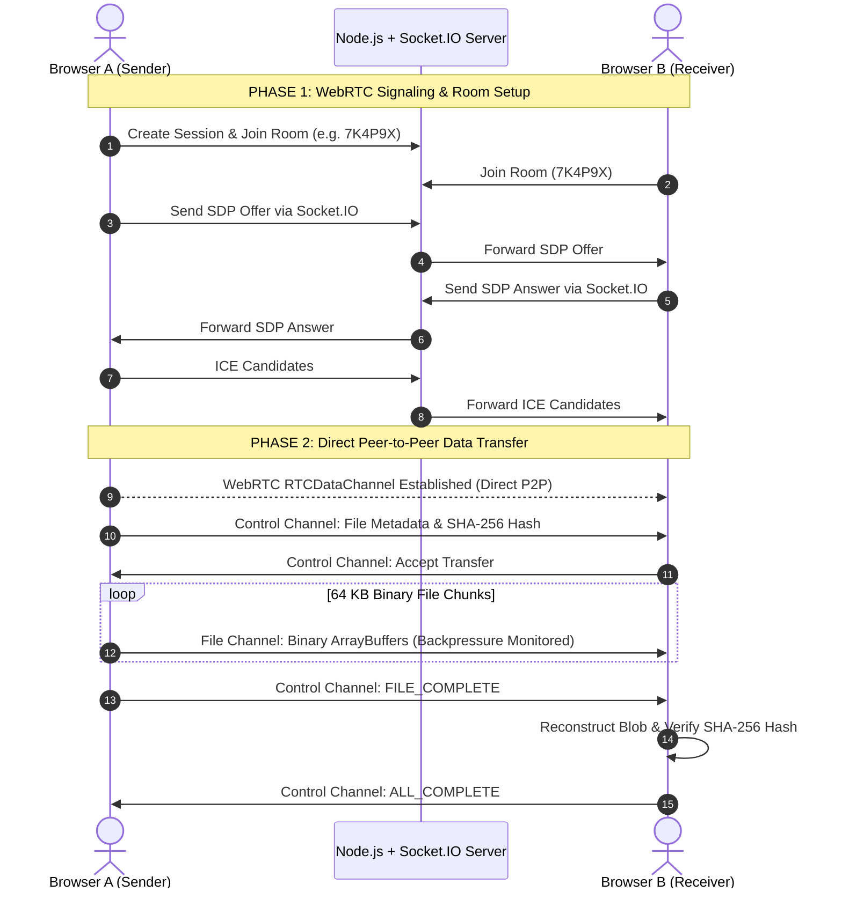

# PeerDrop — "Send files. Directly."


> **PeerDrop** is a production-quality, secure peer-to-peer file sharing application built with React, Vite, Node.js, Express, Socket.IO, WebRTC (`RTCDataChannel`), PostgreSQL, and Prisma.

---

## 🔒 Security & Data Architecture Guarantee

**The backend server NEVER receives, buffers, or stores actual file contents.**

- **Signaling**: The Node.js + Express + Socket.IO server exists exclusively to negotiate authentication, generate transfer room codes, coordinate peer sessions, and exchange WebRTC SDP Offers, SDP Answers, and ICE candidates.
- **File Data Transfer**: All binary file data flows **directly** between peer web browsers via encrypted WebRTC `RTCDataChannel`.



---

## ✨ Core Features

- **Direct WebRTC P2P Transfer**: File chunks stream directly browser-to-browser with 0 MB server storage overhead.
- **Apple Design Language**: Styled according to Apple's WWDC *Designing Fluid Interfaces* guidelines:
  - Instant touch-down press feedback (`scale(0.97)` active states).
  - Spring-based physical motion curves (`damping: 1.0`, velocity handoff).
  - Translucent glass materials (`backdrop-filter: blur(20px)`).
  - Typography optical sizing & size-specific tracking tables.
  - Dark mode with seamless theme toggle.
  - Accessibility first (`prefers-reduced-motion` cross-fades, `prefers-reduced-transparency` fallback).
- **Multi-Channel Architecture**:
  - `control`: Reliable JSON channel for transfer lifecycle (`METADATA_REQUEST`, `ACCEPT_TRANSFER`, `CANCEL_TRANSFER`, `FILE_COMPLETE`).
  - `file`: High-speed binary channel for 64 KB file chunks.
  - `chat`: Real-time P2P text messaging alongside transfers.
- **SHA-256 Integrity Verification**: Calculates cryptographic hash via Web Crypto API (`crypto.subtle`) pre/post transfer for 100% byte verification.
- **Backpressure & Flow Control**: Prevents browser memory bloat during multi-gigabyte file transfers using `RTCDataChannel.bufferedAmount` & `bufferedAmountLowThreshold`.
- **Instant QR Code & Room Sharing**: Generates high-density canvas QR codes and shareable links (`https://yourapp.com/receive/7K4P9X`).
- **User Authentication & Session Persistence**: JWT authentication with bcrypt password hashing and persistent Postgres transfer session logs.

---

## 🛠️ Tech Stack

### Frontend
- **Framework**: React 18 + TypeScript + Vite
- **Styling**: Tailwind CSS + Custom Apple Design Tokens
- **Icons**: Lucide React
- **Animation**: Motion / Framer Motion
- **QR Generator**: HTML5 Canvas QR Code (`qrcode`)

### Backend
- **Runtime**: Node.js + TypeScript
- **Web Framework**: Express.js
- **Signaling**: Socket.IO 4
- **Database**: PostgreSQL 16 + Prisma ORM 5
- **Security**: JWT, bcrypt, Helmet, CORS, Rate Limiting, Zod

### WebRTC Specification
- `RTCPeerConnection` with STUN server list (`stun.l.google.com:19302`).
- `RTCDataChannel` (`control`, `file`, `chat`).
- Web Crypto API (`crypto.subtle.digest('SHA-256')`).

---

## 📁 Repository Structure

```
peer-drop/
├── client/                     # React Frontend Application
│   ├── src/
│   │   ├── components/ui/      # Apple Design System UI (Button, GlassCard, ProgressBar, QRCodeModal)
│   │   ├── context/            # AuthContext & Theme state
│   │   ├── hooks/              # Custom hooks (useWebRTC, useFileTransfer, useChat, useAuth)
│   │   ├── pages/              # Landing, Login, Register, Dashboard, Send, Receive, ActiveTransfer, History, Profile
│   │   ├── services/           # WebRTCManager, Chunker (64KB + SHA-256), Receiver, API
│   │   ├── types/              # Shared TypeScript definitions
│   │   ├── App.tsx             # Routes & Protected Route wrapper
│   │   ├── index.css           # Apple design tokens, materials, reduced-motion
│   │   └── main.tsx
│   ├── vite.config.ts
│   └── package.json
│
├── server/                     # Express + Socket.IO Backend Application
│   ├── src/
│   │   ├── controllers/        # Auth & Session controllers
│   │   ├── middleware/         # JWT Auth, Rate Limiter, Error Handler
│   │   ├── routes/             # Auth & Session API endpoints
│   │   ├── sockets/            # WebRTC Socket.IO signaling handler
│   │   ├── utils/              # Prisma client & Room code generator
│   │   └── index.ts            # Server entry point
│   └── package.json
│
├── prisma/
│   └── schema.prisma           # Prisma PostgreSQL schema
│
├── docker-compose.yml          # Docker orchestration (PostgreSQL, Server, Client)
├── .env.example
└── README.md
```

---

## 🚦 Getting Started — Step-by-Step Terminal Commands

### Prerequisites
- **Node.js** v20+ — verify with `node -v`
- **npm** v10+ — verify with `npm -v`
- **Docker Desktop** — needed only for the PostgreSQL database container

---

### Step 1: Clone & Navigate into the Project

```bash
git clone https://github.com/ryanmartin060708-code/peerdrop.git
cd peerdrop
```

---

### Step 2: Install Dependencies (Server + Client)

```bash
cd server
npm install
cd ../client
npm install
cd ..
```

---

### Step 3: Create Your Environment File

**Windows (PowerShell / CMD):**
```powershell
copy .env.example .env
```

**macOS / Linux:**
```bash
cp .env.example .env
```

---

### Step 4: Start PostgreSQL via Docker

Open **Docker Desktop** first, then run:

```bash
docker compose up postgres -d
```

> If you already have PostgreSQL running locally on port 5432, skip this step.

---

### Step 5: Generate Prisma Client & Push Database Schema

```bash
cd server
npm run db:generate
npm run db:push
cd ..
```

---

### Step 6: Start the Backend Server

Open a terminal and run:

```bash
cd server
npx tsx src/index.ts
```

You should see:

```
==================================================
🚀 PeerDrop Server running on http://localhost:5000
⚡ Socket.IO Signaling Server ready
==================================================
```

---

### Step 7: Start the Frontend Dev Server

Open a **second terminal** and run:

```bash
cd client
npx vite --host
```

You should see:

```
VITE v5.4.21  ready in 365 ms

➜  Local:   http://localhost:5173/
➜  Network: http://10.x.x.x:5173/
```

---

### Step 8: Open in Browser

Go to **http://localhost:5173/** — PeerDrop is running!

---

### Testing a Full P2P File Transfer

1. **Sender** — Open `http://localhost:5173` in Chrome.  
   Register an account → Click **Send a file** → Drag & drop files → Click **Create Secure Transfer** → Note the 6-character room code.

2. **Receiver** — Open `http://localhost:5173` in an Incognito window or a different browser.  
   Register a second account → Go to **Receive Files** → Enter the room code → Click **Accept & Connect**.

3. **Transfer** — Files stream directly between the two browser windows via WebRTC `RTCDataChannel`. SHA-256 integrity verification runs automatically on completion.

---

### Build & Verification Commands

```bash
# Backend TypeScript compilation check:
cd server && npm run build

# Frontend production build check:
cd client && npm run build
```

## 🗄️ Database Schema

```prisma
model User {
  id               String            @id @default(uuid())
  email            String            @unique
  name             String
  passwordHash     String
  createdAt        DateTime          @default(now())
  updatedAt        DateTime          @updatedAt
  sentSessions     TransferSession[] @relation("SenderSessions")
  receivedSessions TransferSession[] @relation("ReceiverSessions")
}

model TransferSession {
  id          String        @id @default(uuid())
  roomCode    String        @unique
  senderId    String
  receiverId  String?
  status      SessionStatus @default(WAITING)
  totalSize   BigInt        @default(0)
  fileCount   Int           @default(0)
  createdAt   DateTime      @default(now())
  expiresAt   DateTime
}
```

---

## 🛡️ Security Highlights

1. **Zero File Logging**: File names, file contents, passwords, and JWTs are never logged.
2. **Backpressure Flow Control**: Monitors `RTCDataChannel.bufferedAmount` to maintain a steady memory footprint during large multi-gigabyte transfers.
3. **Application-Layer Verification**: Web Crypto API computes SHA-256 checksums before transmission and after reception to verify bitwise file equality.
4. **Input Sanitization**: All incoming Express payloads are validated via Zod schemas.

---

## 📄 License

MIT © PeerDrop Team
